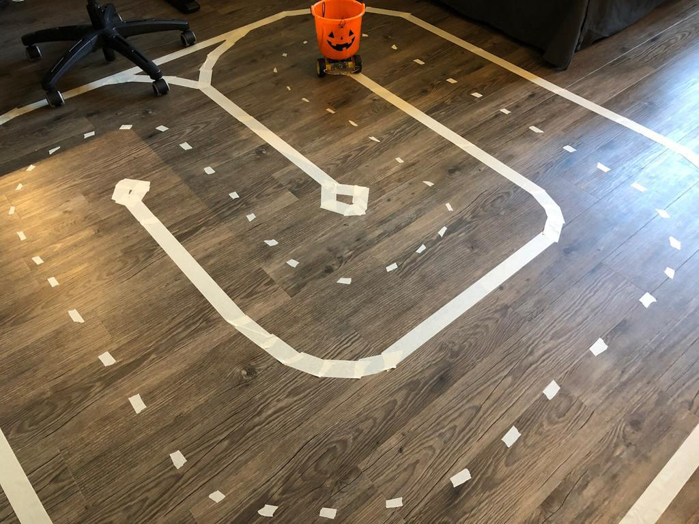

# Self Driving Pumpkin

Simple raspberry pi robot using an inexpensive halloween trick or treat pumpkin for a body. It is trained to drive around a track using keras/tensorflow.

### Parts

1. A raspberry pi
2. A motor controller L298N
3. A camera for the raspberry pi. I used the regular one, the wide angle one is probably better
4. Some DC motors. I used a cheap kit from amazon
5. A pumpkin shaped body
6. Tape, zip ties, various bits of foam etc 

### The model

The robot is trained via behavioral cloning. That is, we manually drive the robot (in this case via a bluetooth ps3 controller) and record sensor/action pairs. In this case the sensor was a camera image and while my actions were throttle and steering angle, I opted to have the robot only learn steering for now. To do this I used a small CNN to extract features from the images and fed these through an LSTM to predict steering angle.

what the pumpkin gets to see

sample input sequence -> output steering angle in -1 to 1

### The Track

I put down lane lines using some masking tape I had laying around. I didn't want the robot to memorize the track so I made a few different tracks and limited the length of sequences.

### Results

It sorta works!

### Next Steps

This was a fun project but I stopped development due to time constraints and because covering the floor with tape isn't the best look for a shared apartment. There are many modifications I plan to do eventually.

1. Add wheel encoders, accelerometers, and some ultrasonic sensors
2. Better mechanical design, as it was the camera vibrated and the angle it faced wasn't ideal etc. Really it wasn't designed just hacked together.
3. Wide angle camera
4. Build a second robot. I'd like to have >=2 robots race and see If maybe I can get some cool emergent aggressive driving behavior.
5. Overhead satellite camera to track the (multiple) robots and get a better ground truth and some performance metrics such as lap time, cross track error etc.

